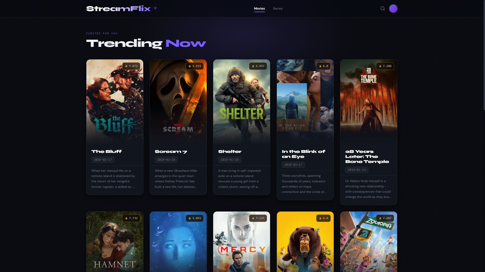
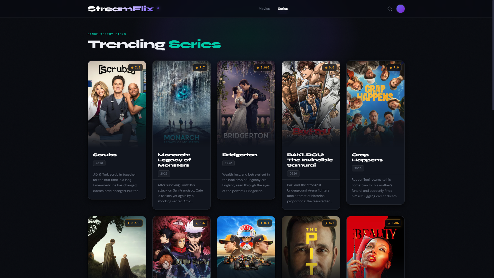

# StreamFlix

A modern, responsive streaming platform showcase built with Flask and The Movie Database (TMDB) API. Browse trending movies and TV series with a sleek, glassmorphic UI.

## Features

- 🎬 **Trending Movies** — Display today's trending movies from TMDB
- 📺 **Trending Series** — Display today's trending TV shows from TMDB
- ✨ **Modern UI** — Glassmorphic design with smooth animations and 3D card effects
- 📱 **Responsive Design** — Mobile-first, fully responsive layout
- 🎨 **Custom Styling** — Tailwind CSS + custom CSS with dark theme
- 🖱️ **Interactive Cards** — Hover effects with 3D tilt transformations
- ⚡ **Fast Loading** — Lazy-loaded images and optimized performance

## Screenshots




## Tech Stack

- **Backend:** Flask (Python)
- **Frontend:** HTML5, CSS3, JavaScript (Vanilla)
- **Styling:** Tailwind CSS
- **API:** The Movie Database (TMDB) API v3
- **Fonts:** Syne, DM Sans, DM Mono (Google Fonts)

## Project Structure

```
.
├── app.py                 # Flask application & route handlers
├── .env                   # Environment variables (API keys)
├── .gitignore             # Git ignore file
├── templates/
│   ├── home.html          # Movies page
│   └── series.html        # Series page
├── static/
│   ├── images/            # Favicon and images
│   └── js/
│       └── main.js        # Shared JavaScript
└── README.md              # This file
```

## Installation

### Prerequisites

- Python 3.8+
- pip (Python package manager)
- A TMDB API account

### Setup

1. **Clone or download the repository:**

   ```bash
   cd aslkdf
   ```

2. **Create a virtual environment:**

   ```bash
   python -m venv .venv
   ```

3. **Activate the virtual environment:**
   - **Windows:**
     ```bash
     .venv\Scripts\activate
     ```
   - **macOS/Linux:**
     ```bash
     source .venv/bin/activate
     ```

4. **Install dependencies:**

   ```bash
   pip install flask requests python-dotenv
   ```

5. **Get TMDB API credentials:**
   - Go to [TMDB](https://www.themoviedb.org/)
   - Create an account or log in
   - Navigate to **Settings → API**
   - Generate an API Read Access Token
   - Also note your API Key (optional for this project)

6. **Create a `.env` file in the root directory:**

   ```
   API_key=your_api_key_here
   API_Read_Access_Token=your_read_access_token_here
   ```

7. **Run the application:**

   ```bash
   python app.py
   ```

8. **Open in browser:**
   Navigate to `http://localhost:5000`

## Usage

### Routes

- `/` — Home page displaying trending movies
- `/series` — Series page displaying trending TV shows

### Features in Action

- **Movie/Series Cards** — Click through to explore trending titles
- **3D Hover Effects** — Move your mouse over cards for interactive tilt animations
- **Responsive Navigation** — Switch between Movies and Series pages
- **Search & Avatar** — UI placeholders for future features
- **Image Lazy Loading** — Images load on-demand for better performance

## API Integration

The application fetches data from TMDB's trending endpoints:

- **Movies:** `/trending/movie/day` — Today's trending movies
- **Series:** `/trending/tv/day` — Today's trending TV shows

Each request includes:

- Authorization Bearer token
- Language preference (English)

## Customization

### Colors & Theme

Edit the CSS variables in `templates/home.html` or `templates/series.html`:

```css
:root {
  --bg-deep: #080a0f; /* Dark background */
  --accent: #7c5cfc; /* Electric indigo */
  --accent-warm: #f5a623; /* Gold accent */
  --accent-teal: #00c9a7; /* Teal (series only) */
}
```

### Fonts

Currently uses Google Fonts:

- **Syne** — Display/titles
- **DM Sans** — Body text
- **DM Mono** — Monospace/meta

Update the font links in the `<head>` to use different fonts.

## Performance Notes

- Images are lazy-loaded from TMDB CDN
- CSS animations use GPU acceleration (`will-change`, `transform`)
- Glass-morphism effects use `backdrop-filter` for modern browsers
- Staggered animation delays prevent layout thrashing

## Browser Support

- Chrome/Edge 90+
- Firefox 88+
- Safari 15+
- Mobile browsers (iOS Safari, Chrome Mobile)

## Troubleshooting

### "API key not found"

- Ensure .env file exists in the root directory
- Check that `API_Read_Access_Token` is correctly set
- Restart the Flask server after updating .env

### "CORS or 403 errors"

- Verify your TMDB API token is active
- Check rate limits (TMDB allows ~40 requests/10 seconds)

### "Images not loading"

- TMDB CDN may be down (rare) or images unavailable for a title
- Fallback placeholder SVG is shown automatically

## Future Enhancements

- [ ] Search functionality
- [ ] Movie/series detail pages
- [ ] User ratings and reviews
- [ ] Watchlist feature
- [ ] Dark/light mode toggle
- [ ] Multiple languages support
- [ ] Filtering and sorting options

## License

This project uses the TMDB API. Please review [TMDB's terms of use](https://www.themoviedb.org/settings/api).

## Contributing

Feel free to fork and submit pull requests!

---

**Made with ❤️ using Flask and TMDB API**
